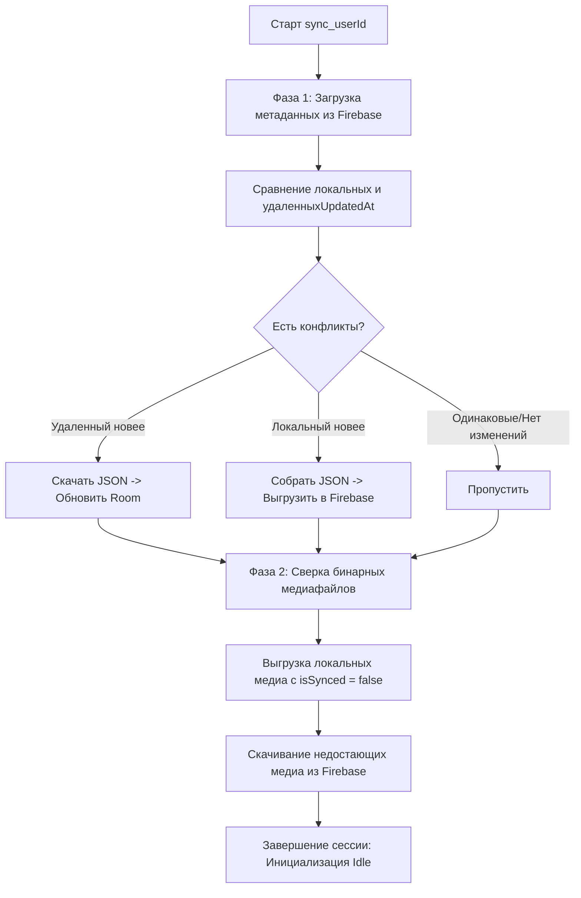

# Модуль синхронизации: Оркестрация SyncManager

Центральным компонентом синхронизации данных между локальным хранилищем (SQLite/Room) и удаленным облаком (Firebase Storage) является класс `SyncManagerImpl`. Система спроектирована по принципу **Offline-First**: пользователь имеет полный доступ к чтению и модификации заметок без активного сетевого соединения, а слияние состояний происходит асинхронно при восстановлении сети.

## 1. Алгоритм синхронизации метаданных (Двухфазный коммит)

Процесс синхронизации запускается вызовом функции `sync(userId: String)` и состоит из двух строго изолированных фаз: синхронизации текстовых данных заметок (метаданных) и синхронизации бинарных вложений (медиафайлов).



###Детальные шаги выполнения:
Запрос облачного слепка: Через CloudDataSource.listNoteMetadata(userId) запрашивается список всех файлов заметок, находящихся в облачной папке users/$userId/notes. Каждая запись содержит key (путь к файлу) и updatedAt (временная метка последнего изменения на стороне Firebase).

Получение локального слепка: Параллельно из NoteDao запрашиваются все локальные записи (включая помеченные как удаленные через флаг isDeleted).

Анализ расхождений:

Если локальная заметка имеет флаг isDeleted = true и isSynced = false, на сервер отправляется запрос на удаление соответствующего JSON-объекта, после чего запись физически стирается из Room.

Если updatedAt в Firebase строго больше, чем локальный updatedAt, локальная запись перезаписывается скачанными данными.

Если локальный updatedAt новее, формируется свежий JSON-пакет и отправляется в Firebase Storage.

##2. Модель полиморфной сериализации заметок
Поскольку заметка (Note) в приложении имеет динамическую структуру и может состоять из произвольного набора контентных блоков (текст, картинки, файлы, ссылки), для её сохранения на сервере применяется полиморфная сериализация на базе kotlinx.serialization.

Преобразование данных изолировано в классе NoteEntityJsonConverter. Каждая заметка упаковывается в текстовый JSON-файл следующей структуры:

```json
{
  "id": "e8ba5411-137a-4c28-9642-e10bcbf14291",
  "userId": "firebase_user_uid_123",
  "title": "Лекция по OpenVINO",
  "folderId": "folder_architecture_01",
  "createdAt": "2026-05-18T10:00:00Z",
  "updatedAt": "2026-05-18T12:45:30Z",
  "isFavorite": true,
  "summary": "Краткое содержание лекции, сгенерированное локальной нейросетью...",
  "contentItems": [
    {
      "type": "com.itlab.domain.model.ContentItem.Text",
      "id": "txt_01",
      "text": "Вводная часть по оптимизации моделей.",
      "format": "PLAIN"
    },
    {
      "type": "com.itlab.domain.model.ContentItem.Image",
      "id": "img_01",
      "source": {
        "remoteUrl": "users/firebase_user_uid_123/media/img_01",
        "localPath": "/data/user/0/com.itlab.notes/files/media/img_01"
      },
      "mimeType": "image/png"
    }
  ]
}
```

###Особенности маппинга:
Поле content: В локальной БД Room для оптимизации поисковых запросов и быстрого рендеринга списков content хранится в виде плоской строки (NoteEntity.content). При сериализации для Firebase SyncManager парсит или собирает полноценный массив contentItems.

Изоляция путей: При передаче в Firebase локальные абсолютные пути устройства (localPath) очищаются или игнорируются на других устройствах, а привязка идет по уникальному remoteUrl, строящемуся по маске users/$userId/media/$mediaId.

##3. Фаза синхронизации медиаресурсов
После завершения сверки текстовых метаданных SyncManagerImpl переходит к обработке бинарных данных (изображения и вложенные файлы), хранящихся в таблице media.

Исходящий поток (Upload): Выбираются все записи из MediaDao.getAllMedia(), у которых isSynced = false. Менеджер открывает inputStream локального файла по адресу localPath и стримит байты напрямую в референс Firebase Storage: rootRef.child(remoteUrl). После успешного завершения статус записи в БД меняется на isSynced = true.

Входящий поток (Download): На основе метаданных, полученных из cloudDataSource.listMediaMetadata(userId), вычисляется разница между файлами на сервере и локальным диском. Для каждого скачиваемого файла:

В системной директории context.filesDir создается папка media/ (если отсутствует).

Выделяется файл с именем, соответствующим чистому ID медиаресурса: File(context.filesDir, "media/$actualMediaId").

Данные скачиваются из облака, и в таблицу media вносится новая запись MediaEntity с типом "IMAGE" или "FILE" в зависимости от его Mime-Type.


### 📂 Создай файл: `docs/sync/workmanager.md`

```markdown
# Модуль синхронизации: Фоновые задачи (WorkManager)

Для обеспечения гарантированной доставки изменений на сервер даже в случае закрытия приложения пользователем, вся инфраструктура запуска синхронизации вынесена из главного процесса UI в системный планировщик **Jetpack WorkManager**.

## 1. Планирование задач через WorkManagerSyncScheduler

Запуск фонового процесса инкапсулирован в классе `WorkManagerSyncScheduler`, реализующем доменный интерфейс `SyncScheduler`. Вместо хаотичного вызова корутин из `ViewModel`, отправка триггерится системными намерениями.

### Критерии и ограничения запуска (Constraints):
Для минимизации расхода заряда батареи и исключения ошибок холостых сетевых запросов настраиваются жесткие ограничения:

```
```kotlin
val constraints = Constraints.Builder()
    .setRequiredNetworkType(NetworkType.CONNECTED) // Обязательное наличие интернета
    .build()
```


###Обеспечение уникальности выполнения:
Синхронизация тяжелых файлов и JSON-структур требовательна к транзакционности. Для предотвращения состояния гонки (Race Condition), когда несколько триггеров пытаются одновременно писать данные в одну и ту же учетную запись Firebase, используется механизм уникальных воркеров:

```kotlin
workManager.enqueueUniqueWork(
    "sync_work_$userId",            // Уникальное имя воркера, привязанное к UID пользователя
    ExistingWorkPolicy.REPLACE,     // Стратегия: если прошлый воркер еще работает, заменить его новым
    syncRequest
)
```

Использование ExistingWorkPolicy.REPLACE гарантирует, что если пользователь совершил серию быстрых изменений в заметках, цепочка промежуточных воркеров прервется, и запустится актуальный процесс, содержащий последний слепок локальной БД.
